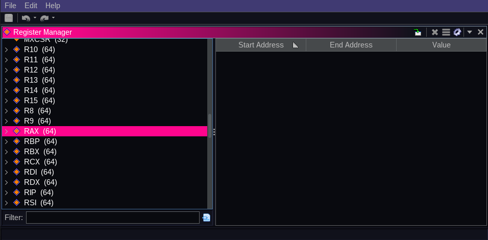

# Blossom Theme for Ghidra

## Preview





## Installation

1. Clone the Github Repository git clone 
```https://github.com/BlossomTheme/Ghidra.git```
2. Open `Ghidra`
3. Go to : `Edit > Theme > Import`
4. Select the `BlossomTheme.theme` file from the cloned location
5. Press `Ok`

Enjoy !